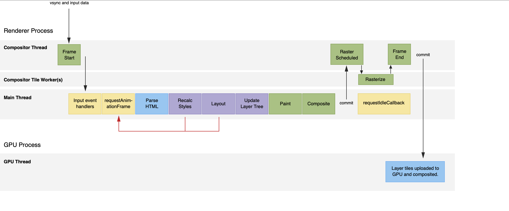

#### 说说CSS选择器和权重
```javascript
!important: 最高权重

内联 : 1000

id : 0100

类选择器/属性选择器/伪类选择器 : 0010

元素选择器/关系选择器/伪元素选择器 : 0001

通配符选择器 : 0000


```
> 伪类，用于向某些选择器添加特殊的效果。用伪类定义的样式并不是作用在标记上，而是作用在标记的状态上，如a标签的:hover，表单元素的:disabled。

> 伪元素，是html中不存在的元素，仅在css中用来渲染的，伪元素创建了一个虚拟容器，这个容器不包含任何DOM元素，但是可以包含内容。如::before、::after。

#### 你知道什么是BFC吗
```plain
BFC，块级格式化上下文（Block Formatting Context）。BFC是W3C CSS2.1规范中的一个概念。它规定了块级元素如何对其内容进行定位以及对其他元素的影响。当一个元素形成BFC之后，它内部的元素不会对元素外面的元素有影响，内部的元素按照它规定的规则进行布局。如浮动可以形成BFC，一个元素浮动之后，它内部的子元素只受它的影响，且两个浮动元素直接是相互不影响的。
```
##### 形成BFC的条件
```plain
- 根元素
- 浮动元素：float不为none元素
- 绝对定位元素：positation为absolute/fixed的元素
- overflow不为visibile的块级元素
- display值为inline-block/table-cell/table-caption
- 弹性盒模型flex

```

##### BFC的约束条件
```plain
- 内部元素会沿着垂直方向一个个的排列
- 处于同一个BFC内的元素直接会相互影响
- 元素之间的间距有margin的值决定
- 相邻元素之间的margin垂直方向的值会发生重叠(外边距重叠)
- 每个元素的左侧与容器的左边相接触
- BFC是一个独立的元素 里面子元素的排列不影响外面元素，反之依然
- 计算高度时，BFC元素考虑浮动元素，即浮动元素的高度也会包含在内
```

##### BFC可以解决的问题
```plain
- 浮动
- 垂直外边距重叠的问题
- margin传递给父元素的问题
```

#### 说说对IFC的认识
```plain
IFC，内联格式化上下文 InlineFormatting Context。IFC的实际高度有其子元素中最高的元素高度计算得来。不受垂直 方向上padding margin的影响。
```

##### IFC的约束条件
```plain
- 内部元素沿着水平方向一个个的排列
- 水平方向的margin padding border会被保留
- 子元素在垂直方向的对齐方式有多种，顶部对其、底部对齐或者根据文字基线对其
```

#### GFC FFC
```plain
GFC(GridLayout Formatting Contexts)直译为"网格布局格式化上下文"，当为一个元素设置display值为grid的时候，此元素将会获得一个独立的渲染区域，我们可以通过在网格容器（grid container）上定义网格定义行（grid definition rows）和网格定义列（grid definition columns）属性各在网格项目（grid item）上定义网格行（grid row）和网格列（grid columns）为每一个网格项目（grid item）定义位置和空间。

FFC(Flex Formatting Contexts)直译为"自适应格式化上下文"，display值为flex或者inline-flex的元素将会生成自适应容器（flex container），可惜这个牛逼的属性只有谷歌和火狐支持，不过在移动端也足够了，至少safari和chrome还是OK的，毕竟这俩在移动端才是王道。

Flex Box 由伸缩容器和伸缩项目组成。通过设置元素的 display 属性为 flex 或 inline-flex 可以得到一个伸缩容器。设置为 flex 的容器被渲染为一个块级元素，而设置为 inline-flex 的容器则渲染为一个行内元素。

伸缩容器中的每一个子元素都是一个伸缩项目。伸缩项目可以是任意数量的。伸缩容器外和伸缩项目内的一切元素都不受影响。简单地说，Flexbox 定义了伸缩容器内伸缩项目该如何布局。
```

#### 了解盒模型吗
```plain
CSS中的盒模型有两种：第一种是W3C的标准盒模型，第二种是IE的怪异盒模型。
在标准盒模型中，盒的实际宽高是：width = 内容width，而IE下的怪异盒模型中：width = 内容width + padding-left + padding-right + border-left + border-rigth。
在W3C标准下：box-sizing: context-box
在IE下：box-sizing: border-box
```


#### 如何实现左侧宽度固定，右侧宽度自适应的布局
```html
<div class="main">
    <div class="left">1</div>
    <div class="right">2</div>
</div>
```

-  float + margin
```html
 <style>
    .main{
        overflow: hidden;
        width: 100%;
        height: 500px;
        color: #fff;
    }
    .main  div{
        height: 100%;
    }
    .left{
        width: 200px;
        background-color: red;
        float: left;
    }
    .right{
        margin-left: 200px;
        background-color: yellowgreen;
    }
</style>
```

- calc + float
```html
<style>
    .main{
        overflow: hidden;
        width: 100%;
        height: 500px;
        color: #fff;
    }
    .main  div{
        height: 100%;
    }
    .left{
        width: 200px;
        background-color: red;
        float: left;
    }
    .right{
        width: calc(100% - 200px);
        float:right;
        background-color: yellowgreen;
    }
</style>
```

- flex
```html
<style>
    .main{
        width: 100%;
        height: 500px;
        color: #fff;
        display: flex;
    }
    .main  div{
        height: 100%;
    }
    .left{
        width: 200px;
        background-color: red;
    }
    .right{
        flex-grow: 1;
        /* 
         flex-grow: 默认为0 即 存在剩余空间也不放大
         flex-shrink:默认为1 即当空间不足时 默认缩小 
         flex:1 对应 1 1 auto
         flex:默认0 1 auto 对应none
        */
        
        background-color: yellowgreen;
    }
</style>
```

#### 了解跨域吗

同源策略（same origin policy）：同源策略指的是同协议、同域名、同端口号。由Netscoape公司在1995年提出，它是浏览器最核心也是最基本的安全功能。如果缺少了同源策略，浏览器将不再安全，会很容易收到xss、cors等攻击。

同源策略限制了以下几点行为：
- Cookie 和 LocalStorage、SessionStorage无法读取
- DOM 和 JS对象无法获得
- AJAX请求无法发送

##### 如何解决同源策略？
- JSONP
- CORS
- postMessage  + iframe
- Nginx
- Node
- WebSocket
- document.domain

##### JSONP
在html标签中有一些标签在获取资源时是不存在跨域问题的，如img、script等，我们可以利用这个特性达到跨域的目的。
```javascript
//前端
// 动态创建script标签
const script = document.createElement('script')
//后端返回直接执行的方法，相当于执行这个方法，由于后端把返回的数据放在方法的参数里，所以这里能拿到res。
window.jsonpCb = (res) => {
    console.log(res);
    document.body.removeChild(script)
}
script.src = `${url}?${handleData(data)}&cb=jsonpCb`
document.body.appendChild(script)


//服务端
//处理成功失败返回格式的工具
const { successBody } = require('../utli')
class CrossDomain {
  static async jsonp (ctx) {
    // 前端传过来的参数
    const query = ctx.request.query
    // 设置一个cookies
    ctx.cookies.set('tokenId', '1')
    // query.cb是前后端约定的方法名字，其实就是后端返回一个直接执行的方法给前端，
    //由于前端是用script标签发起的请求，所以返回了这个方法后相当于立马执行，并且把要返回的数据放在方法的参数里。
    ctx.body = `${query.cb}(${JSON.stringify(successBody({msg: query.msg}, 'success'))})`
  }
}
module.exports = CrossDomain
```
Web前端事先定义一个用于获取跨域响应数据的回调函数，并通过没有同源策略限制的script标签发起一个请求（将回调函数的名称放到这个请求的query参数里），然后服务端返回这个回调函数的执行，并将需要响应的数据放到回调函数的参数里，前端的script标签请求到这个执行的回调函数后会立马执行，于是就拿到了执行的响应数据。

缺点： JSONP只能发起GET请求

JSONP的安全问题：
- CSRF：解决方法：验证JSONP的调用来源（Referer），服务端判断Referer是否是白名单，或者部署随机Token来防御
- XSS：解决方法：严格定义 Content-Type: application/json，然后严格过滤 callback 后的参数并且限制长度（进行字符转义，例如<换成&lt，>换成&gt）等，这样返回的脚本内容会变成文本格式，脚本将不会执行。

##### CORS
CORS，跨域资源共享（Cross-origin resource sharing）。运行浏览器向服务器发起http请求，从而克服跨域问题。
CORS 分两种情况：简单请求、非简单请求。
- 简单请求
    - 请求方法必须是以下几种：GET、POST、HEAD
    - HTTP的请求头信息不能超过以下几种 ：Accept、Accept-Accept-Language、Content-Language、Last-Event-ID、Content-Type只限于：application/x-www-form-urlencoded、multipart/form-data 、text/plain
    - 简单请求前端无需做额外处理，后台设置，如下
```javascript
//前端设置
var xhr = new XMLHttpRequest();

// 前端设置是否带cookie
xhr.withCredentials = true;

xhr.open('post', 'http://www.domain2.com:8080/login', true);
xhr.setRequestHeader('Content-Type', 'application/x-www-form-urlencoded');
xhr.send('user=admin');

xhr.onreadystatechange = function() {
    if (xhr.readyState == 4 && xhr.status == 200) {
        alert(xhr.responseText);
    }
};

```

```javascript
//后台设置
var http = require('http');
var server = http.createServer();
var qs = require('querystring');

server.on('request', function(req, res) {
    var postData = '';

    // 数据块接收中
    req.on('data', function(chunk) {
        postData += chunk;
    });

    // 数据接收完毕
    req.on('end', function() {
        postData = qs.parse(postData);

        // 跨域后台设置
        res.writeHead(200, {
            'Access-Control-Allow-Credentials': 'true',     // 后端允许发送Cookie
            'Access-Control-Allow-Origin': 'http://www.domain1.com',    // 允许访问的域（协议+域名+端口）
            /* 
             * 此处设置的cookie还是domain2的而非domain1，因为后端也不能跨域写cookie(nginx反向代理可以实现)，
             * 但只要domain2中写入一次cookie认证，后面的跨域接口都能从domain2中获取cookie，从而实现所有的接口都能跨域访问
             */
            'Set-Cookie': 'l=a123456;Path=/;Domain=www.domain2.com;HttpOnly'  // HttpOnly的作用是让js无法读取cookie
        });

        res.write(JSON.stringify(postData));
        res.end();
    });
});

server.listen('8080');
console.log('Server is running at port 8080...');
```

- 非简单请求

非简单请求是那种对服务器有特殊要求的请求，比如请求方法是PUT或DELETE，或者Content-Type字段的类型是application/json。非简单请求的CORS请求，会在正式通信之前，增加一次HTTP查询请求，称为"预检"请求（preflight）。


Access-Control-Request-Method：该字段是必须的，用来列出浏览器的CORS请求会用到哪些HTTP方法。


Access-Control-Request-Headers：该字段是一个逗号分隔的字符串，指定浏览器CORS请求会额外发送的头信息字段，上例是X-Custom-Header。


如果浏览器否定了"预检"请求，会返回一个正常的HTTP回应，但是没有任何CORS相关的头信息字段。这时，浏览器就会认定，服务器不同意预检请求，因此触发一个错误，被XMLHttpRequest对象的onerror回调函数捕获。

##### JSONP和CORS的对比
- JSONP只支持GET请求，CORS支持所有类型的HTTP请求
- JSONP的优势在于支持老式浏览器，以及可以向不支持CORS的网站请求数据

#####  postMessage + iframe
postMessage是HTML5 XMLHttpRequest 的一个API，是可以跨域操作的window属性之一。它可以解决以下问题：
- 页面和其打开的新窗口之间的数据传递
- 多窗口之间的消息传递
- 页面与嵌套的iframe之间的消息传递

用法：postMessage(data,origin)
- data：html5规范支持任意基本类型或可复制的对象，但部分浏览器只支持字符串，所以传参时最好用JSON.stringify()序列化。
- 协议 + 域名 + 端口号，可以为*，如果需要是当前窗口同源，设置为/即可

例子：
```javascript
//a.html
var iframe = document.getElementById('iframe');
var data = 'kaka';
iframe.contentWindow.postMessage(data,'http://172.17.106.85:8080/b.html');
//设置监听
window.addEventListener('message',function(e){
    console.log('a接收到的数据：' , e.data)
})

//b.html
window.addEventListener('message',function(e){
    console.log('b接收到的数据：',e.data);
    window.parent.postMessage('你好 我已经收到信息。',e.origin)
})

```

##### Nginx

原理：同源策略是浏览器的安全策略，不是HTTP协议的一部分，服务端调用HTTP之后并不会执行JavaScript，不需要同源策略，所以也就不存在跨域。

实现：使用Nginx配置一个服务器，做个反向代理。

##### Node

原理大致和Nginx相同，使用Node起一个服务器。下面给一个express的例子。
```javascript
var express = require('express');
var proxy = require('http-proxy-middleware');
var app = express();

app.use('/', proxy({
    // 代理跨域目标接口
    target: 'http://www.domain2.com:8080',
    changeOrigin: true,
    // 修改响应头信息，实现跨域并允许带cookie
    onProxyRes: function(proxyRes, req, res) {
        res.header('Access-Control-Allow-Origin', 'http://www.domain1.com');
        res.header('Access-Control-Allow-Credentials', 'true');
    },
    // 修改响应信息中的cookie域名
    cookieDomainRewrite: 'www.domain1.com'  // 可以为false，表示不修改
}));

app.listen(3000);
console.log('Proxy server is listen at port 3000...');
```

##### WebSocket

WebSocket是HTML5 的一种新协议，它实现了浏览器和服务器之间全双工的通信方式，同时是一种运行跨域的一种通信方式。


##### document.domain

此方案仅限主域名相同，子域名不用的情况。
原理：两个页面通过JavaScript强制设置domain为主域，就实现了同域。

#### HTTP2 和 HTTP1

##### 相比于HTTP1.0 HTTP1.1做了以下优化
- 缓存处理：
    - HTTP1.1 : 强缓存：Cache-Control/Max-Age 协商缓存：If-None-Match/ETag 
    - HTTP1.0 : 强缓存：Expires 协商缓存：If-Modified-Since/Last-Modified
- 长连接：在HTTP1.0中默认是短连接，也就是每次请求都需要重新建立连接，而HTTP协议是建立在TCP/IP协议之上的，每次建立连接都需要重新进行三次握手/四次挥手，这样就会造成很大的浪费。所以在HTTP1.1中支持了长连接，浏览器默认开启Connection：keep-alive。多个请求可以公用同一个连接。
- 错误状态码：在HTTP1.1中，新增了24个错误请求状态码，如409，表示请求的资源和当前资源的状态冲突。410，表示服务器上某个资源被永久性删除。
- 带宽优化及网络连接的使用：在HTTP1.0中，存在浪费带宽的现象，如我只需要对象的一部分，但是服务器却将整个对象返给了我，而且还不支持断点续传。HTTP1.1则在请求头中加入了range属性，它允许只请求某个资源的某一部分。即返回状态码为206。

##### HTTP2.0和HTTP1.1的比较

- 二进制分帧：使用二进制的格式进行数据传输，更加高效，更加紧密
    - HTTP1采用的是使用换行符对文本进行分割、传输
    - 而HTTP2.0则是将传输信息分成更小的信息和帧，具体的分帧浏览器和服务器会自动完成。
- 多路复用：
    - 在HTTP1.1中每次请求都会重新建立一次连接，重新进行三次握手、四次挥手，即使开启了Connection：keep-alive，也会存在着队首阻塞的问题，即如果；一次性发起10条HTTP请求，如果第三条的HTTP请求堵塞了，则会造成后面的所有请求都会等待第三条HTTP请求，从而造成网络性能的降低。
    - 在HTTP2.0中，有两个非常重要的概念：帧 和 流。
        - 帧：表示最小的数据单位，每一个帧中都会存储这对应的流的信息。
        - 流：由帧组成的信息。
    多路复用就是在一个TCP/IP连接中可以同时存在着多次请求的数据，每个帧的头部都会保存着归属于流的信息，在浏览器和服务器端会被重新组装起来，组装车不同的完整的流信息。
    - 这样就解决了HTTP1.1中存在的队首阻塞问题，也提高了网络的利用率，消除了不必要的延迟，从而减少了页面加载的时间。


#### 你能说说缓存吗

缓存分为强缓存和协商缓存。在强缓存且未过期的情况下，不经过服务器，对应的状态码事200。协商缓存需要经过服务器，对应的状态码为304。强缓存
强缓存：
- Expires：http1.0。其值为服务端返回的到期时间，当再次请求时间小于该时间，则直接使用缓存文件。
- Cache-Control：http1.1。
    - max-age = t:设置缓存时间在ts之后失效。
    - private：只有客户端可以缓存。
    - public：客户端和代理服务器都可以缓存。
    - no-cache：只用协商缓存进行验证
    - no-store：不缓存
协商缓存：
- If-Modified-Since：http1.0。在浏览器请求头中，其值为缓存中设置的最后修改时间，对应的服务端字段为Last-Modified（服务端告诉浏览器文件最后修改的时间）。
- If-None-Match：http1.1。其值为文件指纹。再次请求的时候，浏览器会带上此字段，服务器端发现请求头带有此字段时，会与被请求的资源文件的唯一标识进行对比：相同，返回304；不同，返回200 和 新的资源文件。对应服务器端的ETag。

缓存场景：
一般在项目中，我们都是使用强缓存加上协商缓存搭配使用。但是有一些特殊的场景，需要额外的配置。
- 对于不需要缓存的资源，直接使用Cache-Control: no-store。如首页
- 对于频繁更新的资源文件，使用Cache-Control: no-cache 结合 ETag使用

##### 首屏加载优化
- 路由懒加载（webpack代码分割）
- 异步组件
- 代码分割，将通用的第三方库抽离出来vendor 放在cdn
- Nginx配置gzip压缩
- 服务端渲染SSR
- UI库使用按需加载
- 使用link加载的资源配置rel属性prefetch 在浏览器空闲时预加载未来需要使用的文件

#### 谈谈你对作用域链的理解
在了解作用域链之前，我们需要知道以下几个概念：
- 执行环境EC（Execution Context）
- 执行环境栈ECS（Execution Context Stack）
- GO
- VO
- AO

首先，当JS引擎在进入一段可执行代码之前，会先做以下几步：
- 创建一个执行环境栈ECS，同时还会创建一个执行环境EC。
- 创建一个全局对象GO（global object），将Math、Date等属性挂载在上面。
- 最后JS引擎会创建一个与EC相关的变量对象VO，如果当前执行环境为函数，则此时AO（活动对象）即为VO。

当一个函数在创建的时候，函数会有一个与之相关联的属性[[scope]] 该属性指向函数的定义时的执行环境EC，找到VO。如果是函数执行阶段，则指向函数的AO。该属性的下一个对象来自于下一个包含环境。当JS在进行标识符解析的时候，会首先在当前作用域内寻找，如果找不到，则沿着该属性的指向，不断的向上寻找，知道找到为止或者找到GO为止。如果仍然找不到，如果执行的是LHS则会在全局声明一个新的变量；如果为RHS，则报错：ReferenceError。这样由多个VO/AO组成的链表结构就是作用域链。

#### null和undefined的区别

参考：http://www.ruanyifeng.com/blog/2014/03/undefined-vs-null.html

null：表示无，不存在的意思。转为数值0

undefine：表示定义了，但是尚未赋值。转为数值NaN

#### 闭包的作用

##### 什么是闭包
闭包，个人的理解就是由于函数的嵌套，并可以读取其他函数内部变量的函数。

##### 闭包的作用
- 使得函数可以访问其他函数中的变量
- 缓存一个变量，实现私有变量 私有方法

#### 了解EventLoop吗
浏览器是多进程的，如：渲染进程（浏览器内核）、主进程、GPU进程、第三方插件进程等。浏览器中每一个tab页都是一个独立的进程，进程与进程之间相互独立，这样就可以避免进程之间的影响。如一个进程崩溃，其他进程不会收到影响。

在浏览器主进程中，包含有多个线程，线程只能依赖于进程。如JS引擎线程、事件触发器线程、定时触发器线程、GUI线程、HTTP请求线程等。

其中，事件触发器线程中管理着一个任务队列，JS引擎线程管理着任务执行栈。那么事件触发器线程中的任务是哪里来的呢？其实这些任务都是由JS引擎线程在执行代码的时候调用一些API的时候产生的回调函数，JS引擎线程将这些回调函数放进事件触发器线程，当JS引擎的执行栈中的任务执行完毕之后，会从事件触发器线程中取出来任务放进执行栈中执行。如果事件触发器线程中没有需要执行的任务，则JS引擎会在下次继续询问。如此循环，就形成了浏览器的事件循环机制。JS中有两种任务类型，微任务（microtask）和 宏任务（macrotask），在es6中，微任务称为jobs，宏任务称为task。

- 宏任务：script主代码块、setTimeout、setInterval、setImmediate、I/O、UI Rendering
- 微任务：process.nextTick、Promise、Object.observe、MutationObserver


在Node中，宏任务分为六个阶段：
- timers阶段：执行setTimeout、setInterval的回调函数
    - 执行所有的Next Tick Queue 和 微任务
- I/O阶段：执行除了close、setImmeiate、setTimeout和setInterval之前的回调函数。
    - 执行所有的Next Tick Queue 和 微任务
- idle prepare阶段：内部调用阶段
    - 执行所有的Next Tick Queue 和 微任务
- poll阶段：获取新的I/O事件
    - 执行所有的Next Tick Queue 和 微任务
- check阶段：执行setImmediate的回调函数
    - 执行所有的Next Tick Queue 和 微任务
- close阶段：执行close阶段
    - 执行所有的Next Tick Queue 和 微任务

process.nextTick归属于microtask，但是它优先于所有的microtask执行。

#### 什么是回流和重绘？

##### 浏览器渲染
- 浏览器采取流式布局模型。
- 浏览器会把HTML解析成DOM Tree，将CSS解析成CSS Tree，DOM Tree 和 CSS Tree合并就成了Render Tree。
- 有了RenderTree之后，就可以获取元素在页面上的每一个节点样式、布局，这样就可以将节点绘制到页面上。
- 由于浏览器使用流式布局，对Render Tree的计算通常只需要遍历一次就可以完成，但table及其内部元素除外，通常需要多次计算且要花费3倍于同等元素的时间，这也是为什么要避免使用table布局的原因之一。

浏览器渲染过程：
- 解析HTML，生成DOM Tree
    - 词法解析：浏览器获得的bytes基于它的编码格式转换为字符串。然后浏览器根据HTML规范将这些字符串解析成词法单元流token。每一个token都会有自己独特的含义和规则。
    - 语法解析：将上一步生成的token数组，转换成一个元素相互嵌套所组成程序语法结构树。这个语法树被称为抽象语法树。
    - 然后将AST解析成浏览器可以执行的语言，称之为代码生成。
- 解析CSS，生成CSS Tree
    - 规则同上一步
- 将DOM Tree和CSS Tree合并生成Render Tree
- Layout：重排布局，根据Render Tree，获取节点的各种数据，如位置信息、结构、尺寸等。
- Paint：重绘，即元素的外观属性发生了变化，如颜色等。根据渲染树以及回流得到的几何信息，得到节点的绝对像素
- Display：将像素发送给GPU，展示在页面上。


##### 回流和重绘

触发回流的条件：
- 页面初始化渲染
- 添加或删除元素
- 元素触发Layout
- 窗口resize
- 获取元素的某个元素
    - offsetTop/Left/Width/Height
    - scrollTop/Left/Width/Heigth
    - clientTop/Left/Width/Height
    - width/heigth
回流一定会触发重绘，但是重绘不一定触发回流。

##### 优化方案
- 减少逐步改变dom，一次性改变，或者使用class改变样式
- 避免循环中操作dom，可以使用documentFragment或者div进行包裹，在上面进行操作。
- 使用requestAnimationFrame
- 避免CSS 嵌套层数过高
- 使用CSS 硬件加速

##### 硬件加速原理
在浏览器渲染进程中，有一个主进程main thread 、排版线程compositer thread、Tile worker。



- compositer thread：排版线程，接收同步事件，将数据交给GPU渲染，如果有js逻辑或者重绘重排，需要主线程的参与，则唤醒主线程。
- main thread 主线程：执行解析、layout布局、paint、requesyIdleCallback等
- Tile Worker负责栅格化，获取元素节点数据，将cpu数据格式转换成gpu认识的数据格式，然后提交commit给GPU。
- GPU进程负责渲染。

使用硬件加速的原理主要就是使用这些css属性时，变更元素时，只会触发排版线程，不会触发主线程，不会引起Layout、Paint。具体的哪些css属性，可以在这个网站看https://csstriggers.com/。


#### Array.prototype.map(callback,thisArg)
- callback 
    - currentValue
    - index
    - array
- thisArg: 执行回调函数时的this