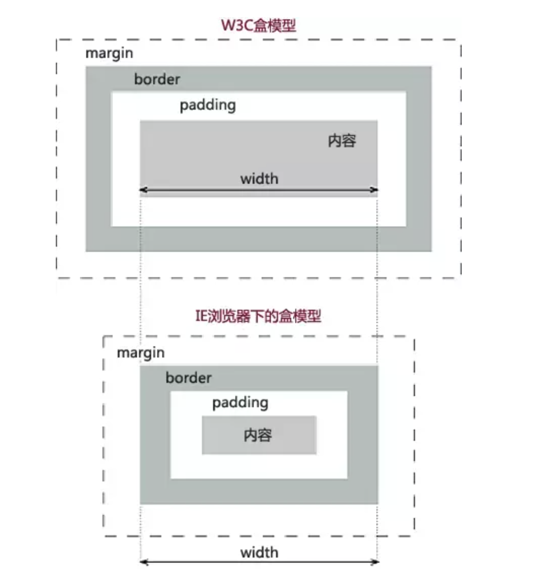

#### 说说CSS选择器和权重
```javascript
!important: 最高权重

内联 : 1000

id : 0100

类选择器/属性选择器/伪类选择器 : 0010

元素选择器/关系选择器/伪元素选择器 : 0001

通配符选择器 : 0000


```
> 伪类，用于向某些选择器添加特殊的效果。用伪类定义的样式并不是作用在标记上，而是作用在标记的状态上，如a标签的:hover，表单元素的:disabled。

> 伪元素，是html中不存在的元素，仅在css中用来渲染的，伪元素创建了一个虚拟容器，这个容器不包含任何DOM元素，但是可以包含内容。如::before、::after。

#### 你知道什么是BFC吗
```plain
BFC，块级格式化上下文（Block Formatting Context）。BFC是W3C CSS2.1规范中的一个概念。它规定了块级元素如何对其内容进行定位以及对其他元素的影响。当一个元素形成BFC之后，它内部的元素不会对元素外面的元素有影响，内部的元素按照它规定的规则进行布局。如浮动可以形成BFC，一个元素浮动之后，它内部的子元素只受它的影响，且两个浮动元素直接是相互不影响的。
```
##### 形成BFC的条件
```plain
- 根元素
- 浮动元素：float不为none元素
- 绝对定位元素：positation为absolute/fixed的元素
- overflow不为visibile的块级元素
- display值为inline-block/table-cell/table-caption
- 弹性盒模型flex

```

##### BFC的约束条件
```plain
- 内部元素会沿着垂直方向一个个的排列
- 处于同一个BFC内的元素直接会相互影响
- 元素之间的间距有margin的值决定
- 相邻元素之间的margin垂直方向的值会发生重叠(外边距重叠)
- 每个元素的左侧与容器的左边相接触
- BFC是一个独立的元素 里面子元素的排列不影响外面元素，反之依然
- 计算高度时，BFC元素考虑浮动元素，即浮动元素的高度也会包含在内
```

##### BFC可以解决的问题
```plain
- 浮动
- 垂直外边距重叠的问题
- margin传递给父元素的问题
```

#### 说说对IFC的认识
```plain
IFC，内联格式化上下文 InlineFormatting Context。IFC的实际高度有其子元素中最高的元素高度计算得来。不受垂直 方向上padding margin的影响。
```

##### IFC的约束条件
```plain
- 内部元素沿着水平方向一个个的排列
- 水平方向的margin padding border会被保留
- 子元素在垂直方向的对齐方式有多种，顶部对其、底部对齐或者根据文字基线对其
```

#### GFC FFC
```plain
GFC(GridLayout Formatting Contexts)直译为"网格布局格式化上下文"，当为一个元素设置display值为grid的时候，此元素将会获得一个独立的渲染区域，我们可以通过在网格容器（grid container）上定义网格定义行（grid definition rows）和网格定义列（grid definition columns）属性各在网格项目（grid item）上定义网格行（grid row）和网格列（grid columns）为每一个网格项目（grid item）定义位置和空间。

FFC(Flex Formatting Contexts)直译为"自适应格式化上下文"，display值为flex或者inline-flex的元素将会生成自适应容器（flex container），可惜这个牛逼的属性只有谷歌和火狐支持，不过在移动端也足够了，至少safari和chrome还是OK的，毕竟这俩在移动端才是王道。

Flex Box 由伸缩容器和伸缩项目组成。通过设置元素的 display 属性为 flex 或 inline-flex 可以得到一个伸缩容器。设置为 flex 的容器被渲染为一个块级元素，而设置为 inline-flex 的容器则渲染为一个行内元素。

伸缩容器中的每一个子元素都是一个伸缩项目。伸缩项目可以是任意数量的。伸缩容器外和伸缩项目内的一切元素都不受影响。简单地说，Flexbox 定义了伸缩容器内伸缩项目该如何布局。
```

#### 了解盒模型吗
```plain
CSS中的盒模型有两种：第一种是W3C的标准盒模型，第二种是IE的怪异盒模型。
在标准盒模型中，盒的实际宽高是：width = 内容width，而IE下的怪异盒模型中：width = 内容width + padding-left + padding-right + border-left + border-rigth。
在W3C标准下：box-sizing: context-box
在IE下：box-sizing: border-box
```


#### 如何实现左侧宽度固定，右侧宽度自适应的布局
```html
<div class="main">
    <div class="left">1</div>
    <div class="right">2</div>
</div>
```

-  float + margin
```html
 <style>
    .main{
        overflow: hidden;
        width: 100%;
        height: 500px;
        color: #fff;
    }
    .main  div{
        height: 100%;
    }
    .left{
        width: 200px;
        background-color: red;
        float: left;
    }
    .right{
        margin-left: 200px;
        background-color: yellowgreen;
    }
</style>
```

- calc + float
```html
<style>
    .main{
        overflow: hidden;
        width: 100%;
        height: 500px;
        color: #fff;
    }
    .main  div{
        height: 100%;
    }
    .left{
        width: 200px;
        background-color: red;
        float: left;
    }
    .right{
        width: calc(100% - 200px);
        float:right;
        background-color: yellowgreen;
    }
</style>
```

- flex
```html
<style>
    .main{
        width: 100%;
        height: 500px;
        color: #fff;
        display: flex;
    }
    .main  div{
        height: 100%;
    }
    .left{
        width: 200px;
        background-color: red;
    }
    .right{
        flex-grow: 1;
        /* 
         flex-grow: 默认为0 即 存在剩余空间也不放大
         flex-shrink:默认为1 即当空间不足时 默认缩小 
         flex:1 对应 1 1 auto
         flex:默认0 1 auto 对应none
        */
        
        background-color: yellowgreen;
    }
</style>
```

#### 了解跨域吗

同源策略（same origin policy）：由NNetscoape公司在1995年提出，它是浏览器最核心也是最基本的安全功能。如果缺少了同源策略，浏览器将不再安全，会很容易收到xss、cors等攻击。
什么是同源策略呢？
同源策略指的是同协议、同域名、同端口号。
同源策略限制了以下几点行为：
- Cookie 和 LocalStorage、SessionStorage无法读取
- DOM 和 JS对象无法获得
- AJAX请求无法发送

##### 如何解决同源策略？
- JSONP
- CORS
- postMessage  + iframe
- Nginx
- Node
- WebSocket

##### JSONP
在html标签中有一些标签在获取资源时是不存在跨域问题的，如img、script等，我们可以利用这个特性达到跨域的目的。
```javascript
//前端
// 动态创建script标签
const script = document.createElement('script')
//后端返回直接执行的方法，相当于执行这个方法，由于后端把返回的数据放在方法的参数里，所以这里能拿到res。
window.jsonpCb = (res) => {
    console.log(res);
    document.body.removeChild(script)
}
script.src = `${url}?${handleData(data)}&cb=jsonpCb`
document.body.appendChild(script)


//服务端
//处理成功失败返回格式的工具
const { successBody } = require('../utli')
class CrossDomain {
  static async jsonp (ctx) {
    // 前端传过来的参数
    const query = ctx.request.query
    // 设置一个cookies
    ctx.cookies.set('tokenId', '1')
    // query.cb是前后端约定的方法名字，其实就是后端返回一个直接执行的方法给前端，
    //由于前端是用script标签发起的请求，所以返回了这个方法后相当于立马执行，并且把要返回的数据放在方法的参数里。
    ctx.body = `${query.cb}(${JSON.stringify(successBody({msg: query.msg}, 'success'))})`
  }
}
module.exports = CrossDomain
```
Web前端事先定义一个用于获取跨域响应数据的回调函数，并通过没有同源策略限制的script标签发起一个请求（将回调函数的名称放到这个请求的query参数里），然后服务端返回这个回调函数的执行，并将需要响应的数据放到回调函数的参数里，前端的script标签请求到这个执行的回调函数后会立马执行，于是就拿到了执行的响应数据。

缺点： JSONP只能发起GET请求

JSONP的安全问题：
- CSRF：解决方法：验证JSONP的调用来源（Referer），服务端判断Referer是否是白名单，或者部署随机Token来防御
- XSS：解决方法：严格定义 Content-Type: application/json，然后严格过滤 callback 后的参数并且限制长度（进行字符转义，例如<换成&lt，>换成&gt）等，这样返回的脚本内容会变成文本格式，脚本将不会执行。

##### CORS
CORS，跨域资源共享（Cross-origin resource sharing）。运行浏览器向服务器发起http请求，从而克服跨域问题。
CORS 分两种情况：简单请求、非简单请求。
- 简单请求
    - 请求方法必须是以下几种：GET、POST、HEAD
    - HTTP的请求头信息不能超过以下几种 ：Accept、Accept-LanAccept-Language、Content-Language、Last-Event-ID、Content-Typ只限于：application/x-www-form-urlencoded、multipart/form-data 、text/plain
    - 简单请求前端无需做额外处理，后台设置，如下
```javascript
//前端设置
var xhr = new XMLHttpRequest();

// 前端设置是否带cookie
xhr.withCredentials = true;

xhr.open('post', 'http://www.domain2.com:8080/login', true);
xhr.setRequestHeader('Content-Type', 'application/x-www-form-urlencoded');
xhr.send('user=admin');

xhr.onreadystatechange = function() {
    if (xhr.readyState == 4 && xhr.status == 200) {
        alert(xhr.responseText);
    }
};

```

```javascript
//后台设置
var http = require('http');
var server = http.createServer();
var qs = require('querystring');

server.on('request', function(req, res) {
    var postData = '';

    // 数据块接收中
    req.on('data', function(chunk) {
        postData += chunk;
    });

    // 数据接收完毕
    req.on('end', function() {
        postData = qs.parse(postData);

        // 跨域后台设置
        res.writeHead(200, {
            'Access-Control-Allow-Credentials': 'true',     // 后端允许发送Cookie
            'Access-Control-Allow-Origin': 'http://www.domain1.com',    // 允许访问的域（协议+域名+端口）
            /* 
             * 此处设置的cookie还是domain2的而非domain1，因为后端也不能跨域写cookie(nginx反向代理可以实现)，
             * 但只要domain2中写入一次cookie认证，后面的跨域接口都能从domain2中获取cookie，从而实现所有的接口都能跨域访问
             */
            'Set-Cookie': 'l=a123456;Path=/;Domain=www.domain2.com;HttpOnly'  // HttpOnly的作用是让js无法读取cookie
        });

        res.write(JSON.stringify(postData));
        res.end();
    });
});

server.listen('8080');
console.log('Server is running at port 8080...');
```

- 非简单请求

非简单请求是那种对服务器有特殊要求的请求，比如请求方法是PUT或DELETE，或者Content-Type字段的类型是application/json。非简单请求的CORS请求，会在正式通信之前，增加一次HTTP查询请求，称为"预检"请求（preflight）。


Access-Control-Request-Method：该字段是必须的，用来列出浏览器的CORS请求会用到哪些HTTP方法。


Access-Control-Request-Headers：该字段是一个逗号分隔的字符串，指定浏览器CORS请求会额外发送的头信息字段，上例是X-Custom-Header。


如果浏览器否定了"预检"请求，会返回一个正常的HTTP回应，但是没有任何CORS相关的头信息字段。这时，浏览器就会认定，服务器不同意预检请求，因此触发一个错误，被XMLHttpRequest对象的onerror回调函数捕获。

#####  postMessage + iframe
